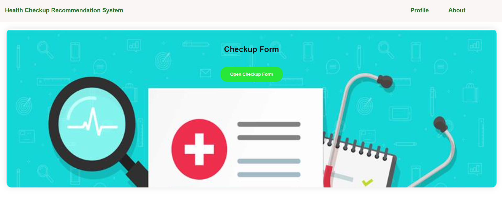

# Health Check Up Recommendation System

## Overview

Welcome to the **Health Check Up Recommendation System**! This project is designed to provide recommendations on whether an individual should visit a doctor based on their common symptoms and lifestyle habits.

## Features

- Input common symptoms and lifestyle habits
- Get personalized health check-up recommendations
- User-friendly interface

## Tech Stack

- **Frontend**: HTML, CSS, JavaScript
- **Backend**: Python, Flask, Jinja2
- **Machine Learning**: Scikit-learn
- **Database**: SQLite

## Installation

### Prerequisites

- Python 3.x installed on your machine
- Pip (Python package installer)

### Steps

1. Clone the repository to your local machine:

2. Create and activate a virtual environment (optional but recommended):

   ```bash
   python -m venv venv
   source venv/bin/activate  # On Windows use `venv\Scripts\activate`
   ```

3. Install the required dependencies:

   ```bash
   pip install -r requirements.txt
   ```

4. Run the application:

   ```bash
   python ./app.py
   ```

5. Open your browser and navigate to `http://127.0.0.1:5000` to view the application.

## Usage

1. Open the application in your browser.
2. Enter the required details about your symptoms and lifestyle habits.
3. Click on the submit button to get a recommendation on whether to visit a doctor or not.

## Contributing

Contributions are welcome! Please feel free to submit a Pull Request.


## Acknowledgements

- Flask for the web framework
- Scikit-learn for machine learning
- SQLite for the database



